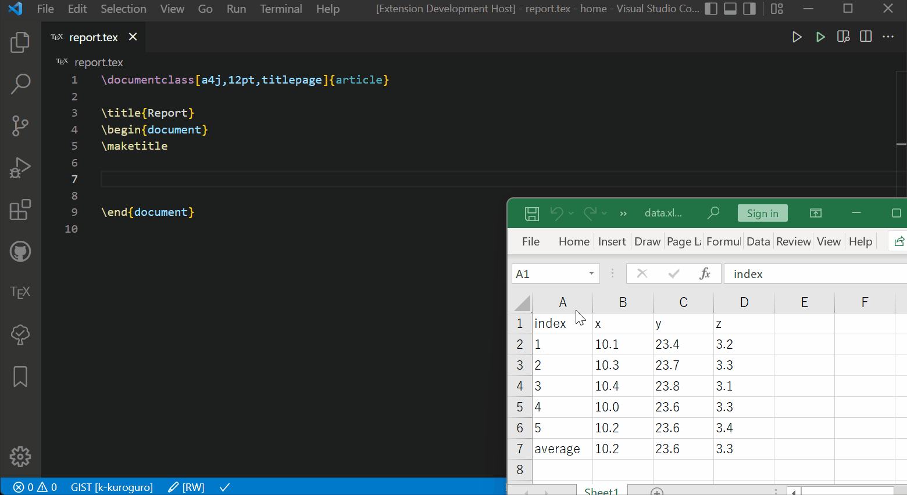

# CSV2LaTeX

    

---

VSCode extension for converting CSV or Excel table to LaTeX tabular.

# How to use

1. Copy CSV or Excel table.
2. Execute command `CSV2LaTeX: Paste As Tabular From CSV` or `Excel` via command palette or context menu.

# Available Commands

 - `CSV2LaTeX: Paste As Tabular From CSV`
 - `CSV2LaTeX: Paste As Tabular From Excel`
